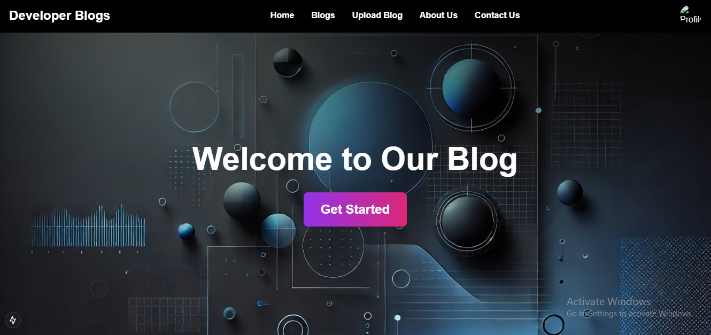

# Developer Blogs

A **MERN stack** web application where developers can **sign up, log in, view blogs, upload their own blogs, and explore content shared by others.**

## Features

✅ User Authentication (Sign Up & Log In)
✅ Create, Read, Update, and Delete (CRUD) functionality for blogs
✅ View blogs uploaded by other users
✅ Responsive UI for seamless experience
✅ Secure authentication with JWT
✅ MongoDB as the database for storing user and blog details

## Tech Stack

- **Frontend:** React.js, Redux (if used), Tailwind CSS/Bootstrap (if used)
- **Backend:** Node.js, Express.js
- **Database:** MongoDB (Mongoose ORM)
- **Authentication:** JSON Web Token (JWT)

## Screenshots

**Home Page:**


**Signup Page:**


**Blog Upload Page:**


## Installation & Setup

1. **Clone the Repository**
```sh
 git clone https://github.com/your-username/developer-blogs.git
 cd developer-blogs
```

2. **Backend Setup**
```sh
 cd backend
 npm install
 npm start
```

3. **Frontend Setup**
```sh
 cd frontend
 npm install
 npm start
```

4. **Database Configuration**
- Make sure MongoDB is running locally or use MongoDB Atlas.
- Create a `.env` file in the `backend` directory and add:
```sh
 MONGO_URI=your_mongodb_connection_string
 JWT_SECRET=your_secret_key
```

## Usage
- Visit `http://localhost:3000` in your browser.
- Sign up and log in to access all features.
- Create and publish blogs easily.
- Browse blogs uploaded by other developers.


---
### 📌 Connect with Me
For any queries or collaboration, reach out to me on:
- LinkedIn: [Your LinkedIn Profile](https://linkedin.com/in/yourprofile)
- GitHub: [Your GitHub Profile](https://github.com/your-username)

